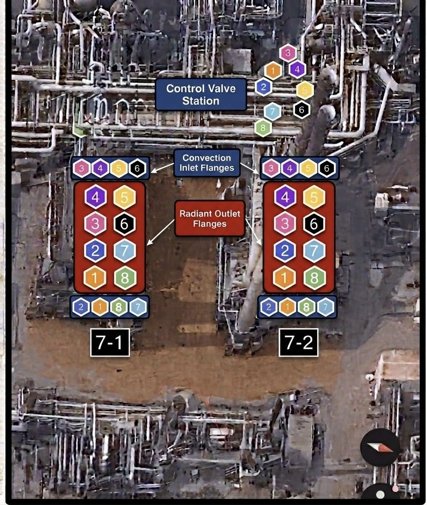
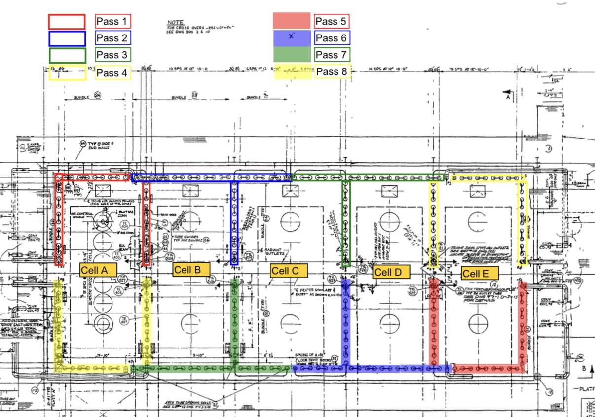
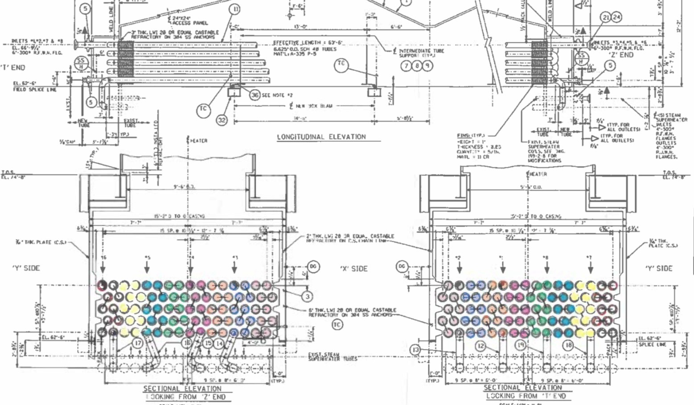

# CAD26001 — Syncrude Mildred Lake, Fort McMurray, AB

> Canadian job — branded **DeBusk Services Canada**, not USADebusk. Naming and logo only; the job
> is sold, planned, mobilized and executed exactly the same way as US work.

> Vault-native copy of the printable crew job sheet. The canonical printable version is
> `CAD26001-job-sheet.pdf` (rendered from `CAD26001-job-sheet.html`). A job sheet is static —
> created at bid-win from the quoted work-up. Actuals and timeline live on the job report, never here.

> [!note] No work-up on file
> **No DSP quotation or work-up for CAD26001 exists in this vault.** PO 1300060001 is the only
> commercial artifact recorded. This sheet therefore carries **no quoted resource plan, no Qty column
> and no man-hour totals** — the Crew & Labor block is a roster, not a billing basis. The duration
> figures below come from the reference build-up
> [[2026-08-21-cad26001-looping-duration-both-ways]], not from a quotation. `source:` records this
> honestly rather than naming a DSP number that does not exist.

---

## Project Details

| Field | Value | Field | Value |
|---|---|---|---|
| Scope | 7-1 F-1 Bitumen Column Feed Heater — w/ Smart Pigging | Job # | CAD26001 |
| Facility | Syncrude Mildred Lake — Fort McMurray, AB | Quote | No DSP work-up on file |
| Mode | Double mode × 2 rigs — 4 looped circuits, all pigged simultaneously | PO # | 1300060001 |
| Project Type | Planned outage — August 2026 (third campaign) | PM | Dacorey Slater |
| Lodging | Camp | Training | CSO / Syncrude Site Specific |

---

## Schedule

| Mobilization | Rig-In / Start | Projected Complete |
|---|---|---|
| Tue Aug 25, 2026 | Wed Aug 26, 2026 | ~7 shifts from rig-in |

| Rig-In | Pig | Smart Pig | Rig-Out | Total |
|---|---|---|---|---|
| 8 | 47 | 18 | 8 | **84 hrs** |

7 shifts. **Rig-over 0** — all 4 circuits run at once.

---

## Crew & Labor

| Shift | Role | Assigned |
|---|---|---|
| Day | Project Manager | Dacorey Slater |
| Day | Operator | Marshall Douglas · Travis Trenholm · Peter Campbell · Jason Harman |
| Night | Supervisor | Sam Mixon |
| Night | Operator | Jesse Utsey · Danilo Ramirez · Rodney Lynch · JC |

No DSP work-up is on file for this job, so **no quoted resource plan or billing basis is carried
here**. Roster is the mobilized crew of 10 — 5 dayshift / 5 nightshift. PM runs dayshift.

---

## Equipment

| Qty | Billable As | Asset | Hrs | Status |
|---|---|---|---|---|
| 2 | Trimax Pumper | Trimax 5 · Trimax 6 | 84 | Trimax 6 — confirm still staged in Canada |
| 2 | Support Unit | Support 5 · Support 6 | 84 | Travel as a set with their Trimax |
| 4 | Crew Truck | 4 × rental | 84 | Confirm inspections / travel ready |

**No filtration on this heater** — settled, not a per-job election. FR coveralls with reflective
striping mandatory. Site driving authorization via Marshall.

---

## 7-1 F-1 — Coil Data & Connections

| Section | Coils | Pipe OD | Wall | Pipe ID | Tube Lgth | Tubes/Coil | Ft/Coil | Metallurgy |
|---|---|---|---|---|---|---|---|---|
| Convection | 8 | 6.625 | 0.280 | 6.065 | 65.0' | 16 | 1,040' | P5 + Incoloy 825 |
| Radiant | 8 | 6.625 | 0.280 | 6.065 | 38.6' | 31 | 1,197' | P5 + Incoloy 825 |

> **Inlets** 6" 300# RFWN · **Outlets** 6" 300# RFWN · **Launchers** 8 × 6" · at grade · **Circuits** 4 looped · 4,474' ea.
>
> **Circuits** — **8 coils looped into 4 circuits with temporary 180s at the radiant outlet flanges — 1&8 · 2&7 · 3&6 · 4&5** (Jesse, 2026-08-25). Follows the physical outlet-spool pairing. Launcher and receiver both land at the control-valve-station end.
> **Temp 90s** — plant installs temporary 90° elbows at both ends, CV station and radiant outlets. Those are what bring both connection points to grade; plant-side prerequisite.
> **Location** — inlets at the control valve station, outlets at the radiant outlet flanges. Under the looped election all 16 pigging spools land at the CV station end and the radiant outlets carry the 4 temporary 180s instead. Everything at grade; nothing on this heater is rigged at elevation.
> **Water** — hydrant. Soda-ash solution mixed in tank, Syncrude site practice.
> **Coil** — heater total 376 tubes / 17,893 ft. Single 6.065" bore throughout — no telescoping, no size sequencing.

Full tube geometry, config rollup and pig spec history: [[7-1-F-1]].

---

## Carry-Forward Notes — Prior Decokes (CAD24002 Apr 2024 · CAD25004 Sep 2025)

| Watch For | Action |
|---|---|
| **Hardest, heaviest coke in the last 3 radiant tubes — 29, 30, 31 — at the outlet of every coil** | Expect the size progression to stall there. Plan polishing passes on the outlet end. |
| **Pig runs expected at 12–15 min** | Materially longer means the coil is fighting — log it on the capture sheet. |
| Pitch / resid on multiple passes | Kicksolve is the precedent remedy. |
| Coils full of resid on arrival; TIs left in coils | Fill / flush before cleaning. Plant pulls TIs from the convection-to-radiant crossovers. |
| Stand-by waiting on plant de-inventory, drain, blinds and temp 90s — 36 hrs in 2024, ~192 hrs in 2025 | History, not a forecast. Customer-caused. Record the **cause** on the capture sheet, don't chase it. |
| Dewater | 10.5" swab, 1600 cfm compressor. |

---

## Reference Drawings (page 2 of the printable)

**Fig 1 — Connection Points.** Both the launcher and the receiver of each circuit are at the control
valve station convection inlet flanges; the temporary 180s are at the radiant outlet flanges. Because the
coils are looped there, **no launcher or receiver lands at the radiant outlet end at all** — the 180s take
their place. Numbers are coils 1–8. **7-2 F-1 is a mirror
image** — plenums, floor access doors, stairways and outlet-tube movement all opposite hand. We work 7-1.

**Fig 3 — Pass Routing, Cells A–E.** All 8 passes traced through the radiant cells. Every coil is
uniform — 47 tubes, 2,237 ft — which is why any pairing gives the same 4,474 ft circuit.

**Fig 2 — Longitudinal & Sectional Elevations.** 6.625" OD Sch 40 tubes, A-335 P-5, 63'-6" effective
convection length. Sectional views looking from the 'Z' and 'T' ends. Inlets 1, 2, 7 & 8 at EL. 66'-9";
inlets 3, 4, 5 & 6 on 6"-300# RF WN flanges. Colour banding is per pass.

---

## Notes

Printable deliverable: `CAD26001-job-sheet.pdf` (source `CAD26001-job-sheet.html`), alongside this
file — two pages, project and heater data on page 1, the three reference drawings on page 2.

Actuals return path is [[cad26001-coilset-capture-sheet]] — per-circuit clock times, coil condition
and pigs run, which feed `## Coilset Durations` on [[7-1-F-1]] at ingest.

**Duration figures are the record of what was planned, not something to re-derive.** CAD26001 is
already awarded and executing; an overrun goes to a change order negotiated by other people. See
[[2026-08-21-cad26001-looping-duration-both-ways]] for the build-up and its scope caveat.
