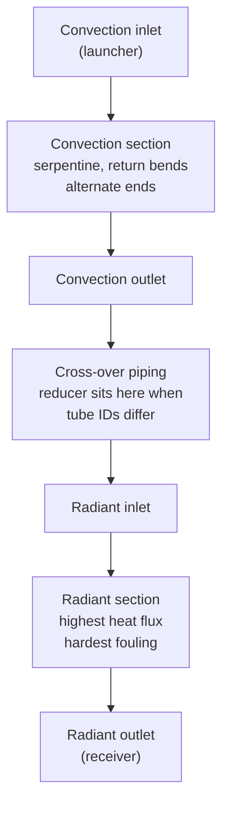

# 3. Heater and Coil Fundamentals

**Layer:** 04-knowledge/manual
**Source:** [[industry-foundation]], `~/.claude/skills/usadebusk-core/SKILL.md`
**Manual:** [[00-manual-index]]

---

This section establishes the vocabulary the rest of the manual uses. Terminology varies between facilities; where a term in this manual differs from local usage, the definitions in [[17-glossary]] are the ones intended.

## 3.1 Heater types

| Type | Description |
|---|---|
| Cabin / Box | Rectangular structure, burners on the floor or side walls. Common in crude and vacuum service. |
| Vertical Cylindrical | Cylindrical shell, floor-mounted burners, coil arranged around the circumference. |
| Arbor / Wicket | Coil hangs in loops. Less common. |

Heater type affects equipment placement, launcher and receiver access, and rig-in complexity more than it affects the cleaning method itself.

## 3.2 Coil sections

A coil is the complete tube assembly for one heater: individual straight tubes joined in series by return bends, arranged into one or more passes. A pass, also called a circuit, is one continuous tube path through the heater. Each pass is cleaned as its own circuit.

**Convection section.** The upper section, heated indirectly by flue gas. Tubes are conventionally arranged horizontally in parallel rows, with return bends alternating ends so that a pig reverses direction at each tube. Lower tube skin temperatures and generally lighter fouling.

**Radiant section.** The lower or inner section, exposed to direct flame radiation. Highest heat flux, hardest fouling, and the radiant outlet is the most fouling-prone location in the coil. Tube arrangement varies genuinely between horizontal and vertical depending on heater type, and is confirmed per heater rather than assumed.

**Cross-over.** The external piping connecting the convection outlet to the radiant inlet. Where convection and radiant tube sizes differ, the reducer that makes the transition sits in this piping.

*Figure 3-1. Coil topology for one pass, shown in the standard convection-to-radiant cleaning direction. Tube count per section is heater-specific.*

<!-- GRAPHIC 3-2: cutaway elevation of a cabin heater. Show convection section (upper, horizontal rows), radiant section (lower, burners at floor), and the cross-over piping running outside the shell between them. Label the three sections and mark the reducer location on the cross-over. Companion to Figure 3-1, which is topological; this one is spatial. -->

## 3.3 Tube size relationship between sections

Convection tube inner diameter is the same as, or smaller than, radiant tube inner diameter on effectively all heaters in this service. This matters because it determines which section governs pig sizing: the smallest inner diameter anywhere in the circuit sets the ceiling for the entire progression, and that is normally a convection dimension.

Where convection and radiant sizes differ, the reducer in the cross-over is a known obstruction point. It is the location at which a pig sized for the larger section cannot continue, and it is addressed explicitly in the pig progression plan for every mixed-size heater rather than discovered in the field.

Multiple size changes within a single pass are possible and are not confined to the cross-over. Each is treated as its own transition in planning.

## 3.4 Tube geometry and connections

**Serpentine.** The standard convection arrangement. Horizontal parallel rows with return bends alternating ends; the pig reverses direction at each tube.

**Helical.** Found in radiant sections of vertical cylindrical heaters, where the coil wraps around the shell circumference.

**Return bend.** A cast 180 degree fitting joining adjacent tubes. The standard connection, and the one a pig traverses most readily.

**Plug header.** A box header with removable plugs at the tube ends, an older design found on some units. Tube-to-tube traversal through a plug header is less direct than through a cast return bend, and one subtype in particular presents a geometry at which a pig can misalign and stall while circuit flow remains fully established. That condition is a recognised, benign, and routine part of working these coils; it is anticipated in the job SOP and handled with a defined foam-assist procedure, and its frequency falls as the tube run progressively cleans. Where a heater has plug-type headers, the job SOP includes that procedure.

## 3.5 Tube dimensions

Common sizes encountered in this service. Full table in [[18-reference-tables]].

| Size | OD | ID |
|---|---|---|
| 4" Sch 40 | 4.500" | 4.026" |
| 5" Sch 40 | 5.563" | 5.047" |
| 6" Sch 40 | 6.625" | 6.065" |
| 8" Sch 40 | 8.625" | 7.981" |
| 10" Sch 40 | 10.750" | 10.020" |

Inner diameter is the figure pig sizing keys off. Outside diameter and schedule are recorded alongside it so the inner diameter can be verified against the drawing rather than taken on assumption.

## 3.6 Metallurgy

**Carbon steel.** The standard case. The mechanical procedure requires no modification.

**Stainless steel.** The mechanical procedure is unchanged. What differs is that a passivation step normally follows mechanical cleaning to restore the passive oxide layer, and that water chemistry, chloride content in particular, becomes a controlled variable. Passivation is customer scope and the governing method is set by the customer's own specification. Section 15 covers what this means for the decoking scope.

Mixed metallurgy within one heater occurs, most often carbon steel convection with a stainless radiant section, and is recorded per section rather than per heater.

---

Previous: [[02-what-mechanical-pigging-is]] · Next: [[04-project-inputs-and-engineering]]
