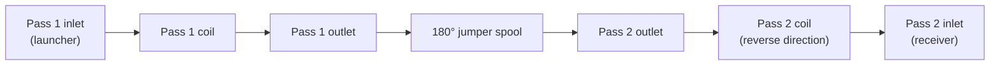

# 9. Phase II — Mechanical Decoking

**Layer:** 04-knowledge/manual
**Source:** `~/.claude/skills/usadebusk-sop/SKILL.md` (Pigging Operations, Flow Path, Looped Circuit), [[process-flow]]
**Manual:** [[00-manual-index]]

---

## 9.1 The flow path

Water is drawn from the clean tank, pressurised by the pump assembly, and delivered through the feed-side Fig. 200 port — Blue in the default direction — and jetting hose to the launching spool. It propels the pig through the coil. At the far end the pig is recovered in the receiving spool, and the water continues back through that spool's jetting hose to the return-side port, along the internal ceiling pipe, past the diverter, and into either the clean or the dirty tank depending on what the operator sees in it.

```mermaid
flowchart LR
    CT["Clean tank"] --> P["Pump assembly"]
    P --> FC["Fig. 200<br/>BLUE port (feed)"]
    FC --> H1["Jetting hose"]
    H1 --> L["Launching spool<br/>(coil inlet)"]
    L --> C["Convection tubes"]
    C --> X["Cross-over"]
    X --> R["Radiant tubes"]
    R --> RC["Receiving spool<br/>(coil outlet)"]
    RC --> H2["Jetting hose"]
    H2 --> FR["Fig. 200<br/>RED port (return)"]
    FR --> CP["Internal ceiling pipe"]
    CP --> D{"Diverter"}
    D -->|"effluent clear"| CT
    D -->|"effluent cloudy"| DT["Dirty tank"]
```

*Figure 9-1. Standard circuit, inlet to outlet direction. In reverse running the return enters through the convection-side port instead; the valve manifold sets direction from the operator station and no hoses are moved.*

## 9.2 The operating cycle

Each pass follows the same cycle, repeated for the duration of the work.

1. **Load.** A pig is loaded into the launcher, the lid is closed and secured, and the system is pressured up.
2. **Launch.** The launch valve is opened and water pressure propels the pig into the coil.
3. **Travel.** The pig traverses the circuit. The operator monitors pressure and flow throughout.
4. **Recover.** The pig arrives at the receiver and is recovered. Its condition is observed.
5. **Observe.** Returning effluent is watched for clarity and for how long discharge continues.
6. **Divert.** The operator holds the diverter to the clean tank while effluent runs clear and throws it to the dirty tank when effluent runs cloudy, which is what keeps working water usable while capturing solids.
7. **Decide.** The next pig is selected: the same size again, or the next size up.
8. **Repeat** until the completion criteria in Section 10 are met.

Where filtration is elected, the filtration loop described in Section 12 runs concurrently and independently throughout.

## 9.3 Simultaneous circuit operation

Each pumping assembly runs one circuit fully independently, with its own direction, flow state, and progression. A single Trimax supports up to three circuits at once and a second unit doubles that. Circuits do not have to be at the same stage as one another, and there is no cross-circuit direction constraint.

Work runs continuously with shift handovers. Progression state for every circuit passes across the handover, because the decision about what pig to run next depends on what the preceding passes did.

## 9.4 Pig progression

Progression is the core of the method. The coil is opened with a small, soft pig and worked upward in controlled increments until it accepts a pig above tube bore with full wall contact.

| Stage | Pig | Purpose |
|---|---|---|
| Opening pass | Foam | Establish a path and confirm flow through the circuit |
| Progressive decoking | Tungsten carbide, undersized, stepping up | Remove deposit in controlled increments |
| Line-size passes | Tungsten carbide at tube ID | Remove the bulk of the coke |
| Oversized passes | Tungsten carbide above tube ID | Wall contact for residual removal |
| Final pass | At maximum permitted OD | Full wall contact, verification |

Four rules govern it.

**Start soft and undersized.** Foam pigs or undersized tungsten carbide pigs open the path. Running a line-size pig into an unopened coil is how obstructions are created.

**Step in 1/8 inch increments.** Each successful pass earns one increment. Sizes are not skipped on the assumption that the coil is cleaner than the previous pass demonstrated.

**The smallest bore in the circuit governs.** Maximum pig OD is the governing tube ID plus 0.250 inches, where the governing ID is the smallest present anywhere in that circuit. On a mixed-size heater that is normally a convection dimension, and it caps the progression for the radiant section too.

**Oversized is deliberate, not incidental.** The final passes run above tube bore by design. The urethane body compresses, the tungsten carbide pins lay back, and the hardness differential means the pins cut coke while deflecting off the tube wall.

**The last of it does not always come off evenly.** On some heaters the progression closes out across the whole circuit at about the same pace. On others a confined section holds out: several pig runs in one area late in the job for very little progress, and that one section can account for a significant share of the total pig hours. This is a **localized hard spot**, and it is normal rather than a defect — which is what separates it from the `outlier` flag on a coil set, where one coil running twelve to twenty-four hours off its siblings means a problem specific to that decoke or corrupt data. A hard spot inside a coil is part of the job. It does not occur on every heater, and without decoke history on that unit there is no reliable way to predict whether it will. Where the crew meets one, it is recorded in Field Notes — where it was, roughly how many runs and hours went into it, and what came back there. Where they do not, nothing is recorded; the absence of a hard spot is not a finding.

**Runs past the result cost tube wall.** The progression ends when the circuit takes a pig at the permitted maximum with full wall contact and the completion criteria are met; pig runs beyond that are not free. Over-cleaning is a recognised failure mode of the method, and it leaves a signature — inspection vendors report horizontal grooving on the inside wall and measurable wall loss, attributed to the combination of oversized pigs, hard appendages and excessive run counts (Quest Integrity, ADCV white paper). This is the reason the maximum OD ceiling and the earned-increment rule above are limits rather than guidelines, and it is why a circuit that will not come clean is escalated rather than run harder. Where the coil will not reach the permitted Clean ID, that is a finding to record and raise with the customer, not a reason for more passes.

A worked example on a 6.065 inch bore tube: open with foam, progress to a 6.0 inch tungsten carbide pig, then to 6.25 inch as the standard final size, and to 6.5 inch where fouling is heavy or the circuit is looped. The ceiling for that tube is 6.315 inches, so a 6.5 inch pig is only permissible where a smaller bore does not govern the circuit.

<!-- GRAPHIC 9-2: pig progression as a stepped sequence. Tube section in cross-section at each stage, showing deposit thickness reducing as pig OD increases: foam opening pass through undersized TC, line-size, oversized, final. Annotate the 1/8" increment and mark the max OD ceiling as a hard line. This is the single most explanatory graphic in the manual. -->

## 9.5 The cross-over transition

Where convection and radiant tube sizes differ, the reducer in the cross-over is the point at which a pig sized for the larger section cannot continue. It is a known obstruction location, addressed explicitly in the progression plan for every mixed-size heater and stated in the job SOP, rather than encountered in the field.

## 9.6 Looped circuits

Where two passes are joined by a jumper spool, the pig runs the first pass in the normal direction, transits the spool, and returns through the second pass in the reverse direction, exiting at the same end it launched from.

**The loop can be made at either end of the passes — outlets or inlets — and there is no default; it is a per-job election.** The consequence for rigging is the one most easily missed reading a sequence written for unlooped passes: **both the launcher and the receiver land at the unlooped end, and the looped end carries no spool at all.** The figure below shows a loop at the outlets; loop at the inlets and it mirrors.

*Figure 9-3. Looped circuit through a customer-fabricated jumper spool.*

Two consequences follow. Transit is longer, a function of footage, bore, and flow rate, which extends the interval during which the pig is in the coil and unobserved, and that interval is monitored deliberately. And the longer combined circuit may require the final pig to be taken to the larger end of the permitted range to achieve full wall contact through its whole length.

## 9.7 Reading the circuit

Three indications tell the operator what is happening inside a coil that cannot be seen.

**Effluent clarity.** Heavily cloudy effluent means material is coming out. Clarity returning and staying clear across successive passes is the leading indicator that a section is cleaning up.

**Discharge duration.** The time effluent continues to discharge after a pass shortens as the bore opens. It is one of the three completion criteria, and it is watched throughout rather than only at the end.

**Pressure and flow response.** A pig meeting resistance in a fouled section shows a pressure rise, and pressure relaxing as it clears is normal. Conversely, a pressure drop accompanied by a flow increase indicates the pig is no longer making effective contact with the wall, which is the signal that the circuit is ready for the next size up.

**Pig condition on recovery.** A pig returning worn or damaged is direct evidence of what it encountered. Condition is observed on every recovery.

## 9.8 Reverse running

Direction is reversible from the operator station through the valve manifold, without moving hoses. Reverse running is used where the progression calls for it, most commonly to approach a section from the other side. Where it is used, the change of direction and the reason for it are recorded.

## 9.9 Plug header hang-ups

On coils with plug-type headers, a pig can misalign within a header and stop advancing while circuit flow remains fully established, with flow passing around the pig rather than through it. This is a hang-up, not a blockage: flow and pressure response remain available throughout, and it is an anticipated, routine feature of working these coils. Frequency depends on header type, plug condition, and how fouled that location is, and it decreases as the tube run progressively cleans.

The response is defined and proceeds in order: confirm continued flow and monitor pressure response; switch flow direction and attempt to reverse the pig back out of the header; use controlled pump output increases to bump the pig in both directions. Where that does not restore movement, flow is shut down, the system is depressurized, and a foam pusher pig is loaded at the original launching end and run in the original direction to contact and dislodge the hung pig, repeating with a fresh foam pig as necessary until the pig is recovered at the receiving end. The event is documented, including pig size, direction of travel, pressure and flow response, and what was required to recover it.

> **CAUTION.** Pump output is not raised beyond the defined pressure limits to force a pig through a header. The response is controlled bumping and foam assist, not additional pressure.

## 9.10 Records

Each circuit carries a running field record through the work: pigs run with size and type, direction of travel, operating pressure and flow, effluent observations, pig condition on recovery, and any anomaly with what was done about it. The record is continuous across shift handovers, and it is the basis of the completion documentation described in Section 16.

---

Previous: [[08-phase-i-rig-in]] · Next: [[10-verification-and-completion]]
