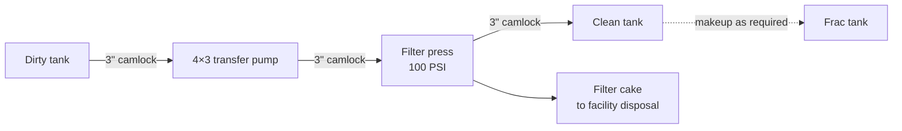

# 12. Filtration and Waste Handling

**Layer:** 04-knowledge/manual
**Source:** `~/.claude/skills/usadebusk-sop/SKILL.md` (Effluent handling), [[equipment-library]]
**Manual:** [[00-manual-index]]

---

## 12.1 Two effluent routes

Every job has to answer one question before rig-in: where does the returning water go. There are two answers, and the facility chooses.

**Open route, the default.** Effluent collects in the dirty tank and discharges to the coke pit drain or oily water sewer. Supply water is made up continuously from a facility source, commonly a fire hydrant. Simple, and appropriate wherever the facility has both an adequate supply and an established route for the discharge.

**Closed loop with filtration.** Effluent from the dirty tank is pumped through a filter press, which separates the solids, and the filtrate returns to the clean tank for reuse. Supply is made up from a frac tank rather than a continuous source.

Filtration is an elected option, not an automatic inclusion. It is not assumed on any job, including jobs where it would seem obvious.

## 12.2 When filtration is elected

Facilities elect filtration for practical reasons that vary by site. The most common is a constrained water supply, where continuous makeup is not available or not permitted. The second is where the working water is itself a controlled input, most often on stainless work with a low-chloride water requirement, where the supply is expensive to produce and worth conserving. The third is where the facility's discharge route cannot accept the solids loading.

Stainless metallurgy makes filtration more likely but does not make it automatic. Some facilities test their water source, confirm it acceptable, and decline filtration on that basis. The decision is the facility's.

## 12.3 The filtration loop

*Figure 12-1. Filtration loop, running concurrently with pigging. All connections 3 inch camlock.*

The loop runs continuously and concurrently with the pigging operation. It is hydraulically independent of the pigging circuit: it draws from and returns to the tanks, and has no influence on coil pressure, flow rate, or pig travel. A filtration problem does not stop the cleaning, and a cleaning problem does not stop the filtration.

Solids collect on the press plates as filter cake and are discharged for disposal through the facility's designated route.

## 12.4 Filtration on multi-unit jobs

Where two Trimax units are deployed, filtration scales conditionally rather than automatically. Where the customer requires dedicated filtration for each unit and a second press is available, two presses and two transfer pumps deploy. Otherwise a single press and pump serve both units, with the dirty tank outlets manifolded to a shared pump suction and filtrate returning to the respective clean tanks.

## 12.5 Waste streams

A decoking job produces the following.

**Effluent water.** Routed either to the facility discharge point or, on a closed loop, recirculated with the tank contents disposed of at completion.

**Filter cake.** Where filtration is used, the separated solids, discharged from the press for disposal.

**Coke fines and recovered solids.** Material recovered from the tanks and the system at completion.

**Residual product.** On coils that carried heavy hydrocarbon, the material removed during the initial flush described in Section 13, generally removed from the dirty tank by vacuum truck.

**Used pigs.** Removed from site with USADebusk equipment.

## 12.6 Disposal responsibility

The facility designates the disposal route for every stream and holds the environmental permitting for it. USADebusk contains the streams within the system, routes them only to designated points, and does not select a disposal route independently.

> **CAUTION.** Where a coil has carried heavy hydrocarbon or where an initial flush has been performed, the resulting stream is characterised and routed before the filtration loop is placed in service. A stream heavy in hydrocarbon is directed to the designated disposal route rather than through the filter press.

## 12.7 Interface with facility systems

Where effluent discharges to a facility coke pit or oily water sewer, the connection point, acceptable flow rate, and any monitoring the facility requires are agreed in planning. Where supply comes from a facility hydrant, the connection point and available flow are confirmed in the same conversation. Both are confirmed before mobilization, because both determine whether the open route is workable at all.

---

Previous: [[11-phase-iii-rig-out-and-restoration]] · Next: [[13-ancillary-initial-flush-and-pitch-removal]]
